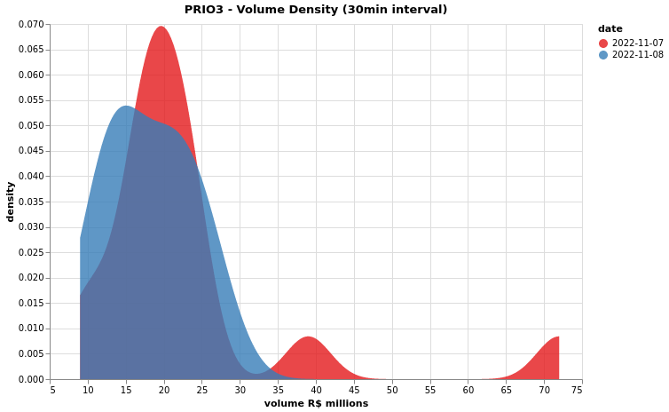
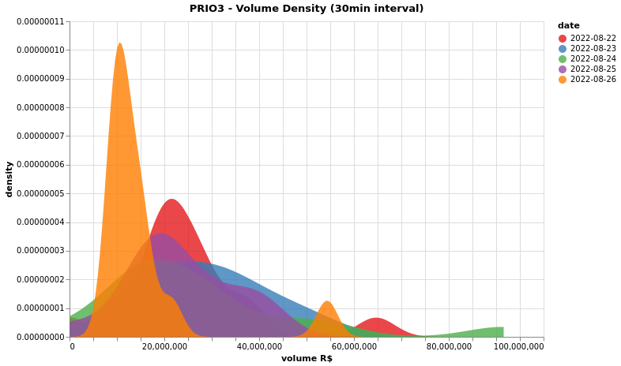
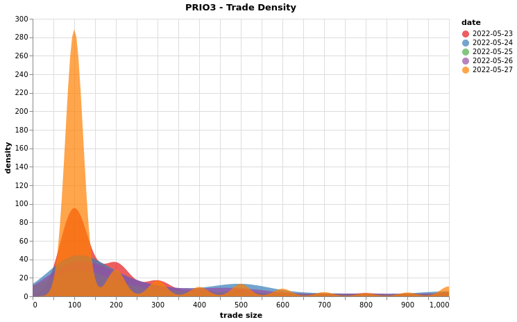
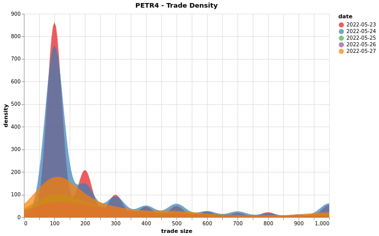

# Chapter 1 - Trading Fundamentals

### Intraday Volume Distribution

To do a proper analysis of the intraday volume distribution, first we need to exclude from the data the opening and closing auctions, since their nature are different from the rest of the day. Thus, we delete from the analysis the first and last row for each day, the rows that contains the final quantity and price of the auctions.

A caveat that needs to be pointed out is the possibility of an auction occurring over the normal trading time, when, for example, the analyzed asset exceeds a certain variation. In this situation, since the data is not annotated with this information, it will be part of the final analysis. Nevertheless, this kind of data in the normal intraday trading contributes to a greater differentiation between the distributions.

The data must be binned in time intervals. I aggregated the data in 30 minute intervals. One choice that needs to be made is when this aggregation starts: whether at the beginning of the asset's trading day (which changes from day to day, according to the dynamics of the opening auction) or at the natural separation of the day's hours.

The following chart shows the intraday volume distribution for the first 2 days of the week for the asset PRIO3.

#### Wasserstein distance for volume distribution

According to Wikipedia, "in mathematics, the Wasserstein distance or Kantorovich–Rubinstein metric is a distance function defined between probability distributions on a given metric space $M$. It is named after Leonid Vaseršteĭn. Intuitively, if each distribution is viewed as a unit amount of earth (soil) piled on M {\displaystyle M} M, the metric is the minimum "cost" of turning one pile into the other, which is assumed to be the amount of earth that needs to be moved times the mean distance it has to be moved. This problem was first formalised by Gaspard Monge in 1781. Because of this analogy, the metric is known in computer science as the earth mover's distance." [(wiki)](https://en.wikipedia.org/wiki/Wasserstein_metric)
Using this metric, we can compare the volume distribution of the asset in different days. The following chart shows the volume distributions for 5 days of the week. The table

The following table shows the Wasserstein distance between the volume distribution of the asset PRIO3 for the 5 days of the week.

|             | 2022-08-22  | 2022-08-23  | 2022-08-24  | 2022-08-25  | 2022-08-26  |
| ----------- | ----------- | ----------- | ----------- | ----------- | ----------- |
| **2022-08-22**  | 0| 12289 | 18161| 13855| 17368 
|**2022-08-23**  | 12289 | 0 | 7929 | 5358 | 8057 
|**2022-08-24**  | 18161 | 7929 | 0 | 7560 | 4395 
|**2022-08-25**  | 13855 | 5358 | 7560 | 0 | 6986 
|**2022-08-26**  | 17368 | 8057 | 4395 | 6986 | 0    

### Intraday Trade Size Distribution

The trade size is the quantity per trade and is a good indicator of the liquidity of the asset. The following charts shows the trade size distribution for the 3 days of a week for the asset PRIO3 and PETR4, with the corresponding distances.

|             | 2022-05-23  | 2022-05-24  | 2022-05-25  | 2022-05-26  | 2022-05-27  |
| ----------- | ----------- | ----------- | ----------- | ----------- | ----------- |
| 2022-05-23  | 0           | 369         | 306         | 400         | 196         |
| 2022-05-24  | 369         | 0           | 222         | 119         | 393         |
| 2022-05-25  | 306         | 222         | 0           | 236         | 254         |
| 2022-05-26  | 400         | 119         | 236         | 0           | 380         |
| 2022-05-27  | 196         | 393         | 254         | 380         | 0           |

|             | 2022-05-23  | 2022-05-24  | 2022-05-25  | 2022-05-26  | 2022-05-27  |
| ----------- | ----------- | ----------- | ----------- | ----------- | ----------- |
| 2022-05-23  | 0           | 391         | 600         | 1196        | 847         |
| 2022-05-24  | 391         | 0           | 417         | 840         | 561         |
| 2022-05-25  | 600         | 417         | 0           | 632         | 419         |
| 2022-05-26  | 1196        | 840         | 632         | 0           | 417         |
| 2022-05-27  | 847         | 561         | 419         | 417         | 0           |

### To Do

- [X] Intraday volume distribution
- [ ] Distribution of spread size
- [X] Disbribution of trade size
- [X] Wasserstein distance for volume distribution
- [ ] Figure 1.4: Futures Rolling

- [ ] X-day average auction volume
- [ ] Beta with respec to an index or sector (plain beta or asymmetric up-days/down-days beta)
- [ ] correlation matrix
- [ ] VWAP
