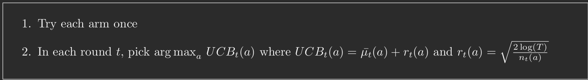

# Theory  of Multi-armed Bandits and Reinforcement Learning

### Lecture 01: Introduction to Bandits and Reinforcement Learning

#### Multi-armed Bandits

- Types: stochastic, contextual, adversarial
- Feedback model: 
	1. Bandit feedback: only the reward corresponding to the selected action is revealed.
	2. Partial feedback: some additional information about the rewards linked to unchosen actions is revealed.
	3. Full feedback: rewards linked to all actions that could have been chosen are revealed.

#### Reinforcement Learning

Can be viewed as a generalization of the bandits setting.

**Comment:** Reinforcement learning can be seen as a generalization of bandits because, while the latter is seen as an algorithm for one-step problems, the former is for sequential problems. Another perspective is to see bandits being applied to problems where the agent's action does not interfere with the next state, while RL modifies, through action, the dynamics of the system. Example: an agent who trades on the stock market several times within a time frame can interfere with market dynamics if the asset being traded is illiquid; otherwise, if the stock is very liquid and the amount traded by the agent is minimal, within a reasonable time frame, the market dynamics are unchanged.

### Lecture 02: Analysis of finite-arm i.i.d.-reward bandit

##### Notation

##### 2.1 Finite-arm i.i.d. Reward Bandit

This is a basic model of the bandit problem with i.i.d. rewards. There are two properties for this problem:
1. It is memoryless, meaning the reward after round $t$ does not depend on any action or reward before round $t$ once the action at round $t$ is given: $\mathbb{P}_{X_{t}|A_{1},X_{1}, A_{2},X_{2}, \dots, X_{t-1},A_{t}} = \mathbb{P}_{A_{t}}$.
2. It is casual, meaning that the action of the learner during round $T$ is influenced by the actions and rewards of previous rounds: $\mathbb{P}_{A_{t}|A_{1},X_{1}, A_{2},X_{2}, \dots,A_{t-1}, X_{t-1}} = \pi_{t}(\cdot | A_{1},X_{1}, A_{2},X_{2},\dots,A_{t-1},X_{t-1})$.

##### 2.2 Designing Algorithms to Minimize Regret

**Definition 1 (Best Arm Benchmark).**  Always playing the optimal arm every round is the best outcome for the learner and results in the best performance for the game. Denote the expected reward of the optimal arm as $\mu^{*}$. We call $T \cdot \mu^{*}$ the best arm benchmark.

**Definition 2 (Random Regret).** Random regret is defined as the difference between the best arm benchmark and our cumulative reward during the game:
$$
\begin{equation*}
	T\mu^{*} - \sum_{t=1}^{T} X_{t} \tag{1}
\end{equation*}
$$

**Definition 3 (Pseudo Regret).** Pseudo regret is the difference between the best arm benchmark and the sum of the expected rewards of each arm played:
$$
\begin{equation*}
	R(T) = T\mu^{*} - \sum_{t=1}^{T} \mu_{A_{t}} \geq 0 \tag{2}
\end{equation*}
$$

**Definition 4 (Worst Case Expected Regret).** Worst case expected regret is defined as the worst-case expected pseudo regret:
$$
\begin{equation*}
	\sup_{\mu_{1}, \mu_{2}, \dots, \mu_{K}} \mathbb{E}[R(T)] \tag{3}
\end{equation*}
$$

##### 2.3 The Explore-then-Commit Algorithm and its Analysis

**Theorem 5 (Hoeffding's Inequality)** Let $X_{1}, X_{2}, X_{3}, \dots \stackrel{i.i.d.}{\sim} P, \mathbb{E}[X_{i}] = \mu$ and $X_{i} \in [0,1]$ with probability 1. Then
$$
\begin{equation*}
	\mathbb{P} \left(\left|\frac{1}{n}\sum_{i=1}^{n}X_{i}-\mu \right| \geq \epsilon \right) \leq 2 \exp \{-2n\epsilon^{2}\}
\end{equation*}
$$
Hoeffding's inequality belongs to a broad class of inequalities, called concentration inequalities.

**Theorem 6.** With $N = (T / K)^{2/3}(\ln T)^{1/3}$, Algorithm 1 achieves worst-case expected regret bound $\mathbb{E}[R (T)] \leq O (T^{2/3}(K \ln T)^{1/3})$.

It is interesting to see that, with such a naive algorithm, the regret bound is sublinear with respect to $T$.

**Definition (Clean Event)** The case when every empirical mean $\bar{\mu}(a)$ stays close to the true expectation $\mu (a)$, and provide a lower bound for $\mathbb{P}(\mathcal{E})$ using Hoeffding's inequality. 

### Lecture 03: Explore then commit and successive elimination

##### 3.2 Adaptive Exploration vs Non-Adaptive Exploration

**Adaptive Exploration:** the choice of next arm depends on the reward history. \
**Non-adaptive Exploration:** pull every arm the same number of times which has been specified without seeing the reward.

**Definition 1.** The true expected reward of bandit arm $a$ is $\mu_{a} = \mu (a) = \mathbb{E}_{\sim \mathbb{P}_{a}}[R_{a,i}]$, for every $i \in [0,T]$.

**Definition 2.** At time $t$, the number of times arm $a$ has been pulled is $n_{t}(a)$.

**Definition (Empirical Average Reward)** The empirical average reward of arm $a$, at time $t$, is:
$$
\begin{equation*}
	\bar{\mu}_{t}(a) = \frac{1}{n_{t}(a)} \sum_{i=1}^{n_{t}(a)} R_{a,i} 
\end{equation*}
$$

**Theorem 3.** Under the setting of Adaptive Exploration, assume we pulled arm $a$ $n_{t}(a)$ times:
$$
\begin{equation*}
	\mathbb{P}\left(|\bar{\mu}(a) - \mu (a)| \leq r_{t}(a)\right) \geq 1 - \frac{1}{T^{4}}
\end{equation*}
$$
where $r_{t}(a) = \sqrt{\frac{2 \log (T)}{n_{t}(a)}}$.

We can no longer apply the Hoeffding's inequality here since it assumes that the sample is drawn independently from a distribution with a fixed number of times.

##### 3.3 Successive Elimination

**Definition 4.**  
Upper Confidence Bound: $\text{UCB}_{t}(a) = \bar{\mu}_{t}(a) + r_{t}(a)$

Lower Confidence Bound: $\text{LCB}_{t}(a) = \bar{\mu}_{t}(a) - r_{t}(a)$

**Theorem 5.** Under The setting of successive elimination, the pseudo-regret
$$
\begin{equation*}
	R (T) \precsim \sqrt{KT \log (T)}
\end{equation*}
$$

### Lecture 04: Analysis of Successive Elimination and UCB Algorithm

The last lecture presented the crucial property:
$$
\begin{equation}
	\Delta (a) = \mu^{*} (a) - \mu(a) \precsim \sqrt{\frac{\log (T)}{n_{T}(a)}} \tag{1}
\end{equation}
$$
for any sub-optimal arm $a$.

##### 4.1 Instance-dependent and Instance-independet Bounds

**INSTANCE-DEPENDENT:** for the problem instance-dependent bound, we build off equation 1 and rearrange terms to get an upper-bound for $n_{T}(a)$:
$$
\begin{equation}
	n_{T}(a) \precsim \frac{\log (T)}{(\Delta (a))^{2}} \tag{4}
\end{equation}
$$

**INSTANCE-INDEPENDENT:** 
$$
\begin{equation}
	R (T) \precsim \sqrt{KT \log (T)} \tag{5}
\end{equation}
$$

##### 4.2 The UCB1 Algorithm

UCB1 Algorithm: Optimism in the face of Uncertainty.

##### 4.3 Phased Successive Elimination

Phased successive elimination is a variation of successive elimination, notably producing an upper-bound that contains a log term that is a function of $K$, rather than $T$. The upper bound of pseudo-regret of this algorithm is $\sqrt{KT \log K}$.

