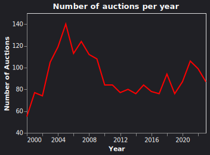

# Brazilian Treasury Bonds

The figure 1 shows the number of auctions per year for the Braziian Treasury Bonds.

 

#### LTN

The LTN (Letra do Tesouro Nacional - Treasury National Note) is a zero coupon bond, which means that the investor will not receive any interest payments during the life of the bond. It pays a face value of R$ 1000 at the maturity date.

**Example 1.1.** 01.06.2016 LTN 

#### NTN-B
