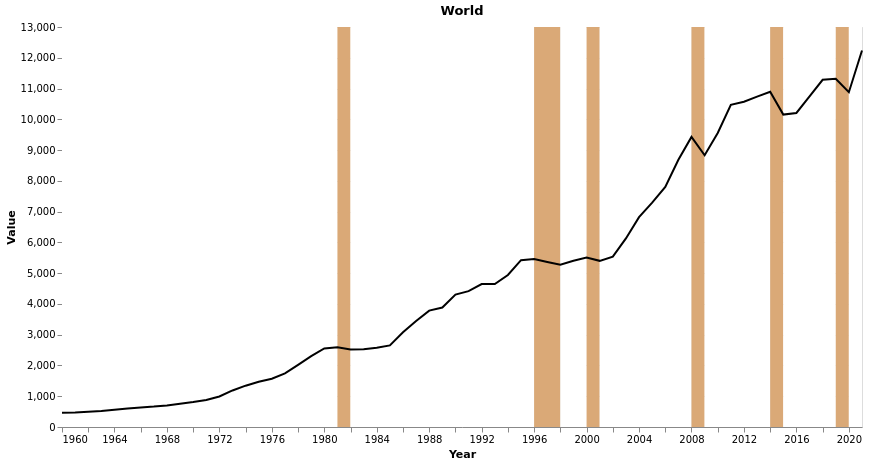
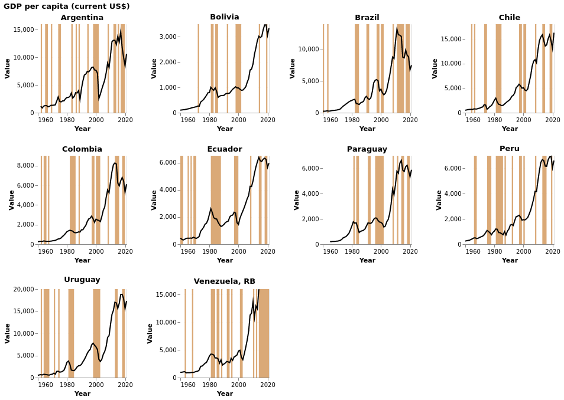

# The Scourge of the Privilege Economy: Brazil, 1947-2020

## Chapter 1 - Growth, fiscal crisis and stagnation: culture and institutions

At the beginning of the chapter the author defines economic stagnation, dividing it in two types: absolute and relative stagnation. Absolute stagnation happens when the per capital income decreases, while relative stagnation happens when the per capita income grows less than global or regional per capita income.

The author then goes on to explain the causes of stagnation in Brazil, which he attributes to a combination of cultural and institutional factors. He argues that the Brazilian culture has been characterized by a lack of trust in the government and a preference for short-term gains over long-term investments. This has led to a lack of investment in infrastructure and education, which has in turn led to a lack of economic growth.

The author also argues that the institutional factors in Brazil have contributed to the stagnation. He points to the lack of fiscal discipline, the lack of transparency in government spending, and the lack of accountability of government officials as contributing to the stagnation.

Finally, the author argues that the stagnation in Brazil has been exacerbated by the rise of the privilege economy, which has allowed the wealthy to benefit from government policies while the poor have been left behind. He argues that this has led to a widening of the income gap and a further entrenchment of the privilege economy.

### Data Analysis
#### Absolute Stagnation

The World Bank has cross-country data on per capita income that can range from 1960 to 2021, depending of the data type. The per capita income can be measured in different ways, using current US dollars or purchasing power parity (PPP). The data is available in the [World Bank's](https://data.worldbank.org/indicator/NY.GDP.PCAP.CD) dataset.

The graph bellow shows the world average per capita GDP in US dollars.

The comparison between the per capita GDP of Brazil and the rest of the world can be seen in the graph bellow.

Is interesting to note that Brazil achieved a GDP per capita higher than the world average only in 2010, after the subprime crisis, but couldn't maintain this for long and the income started to drop sharply from 2013.

The graph bellow shows the per capita income in US dollars for Brazil and the world.

We can also measure the absolute stagnation of a country by comparing its per capita income to its own historical average. To measure the absolute stagnation of a country, we can calculate the ratio of the country's per capita income to its own historical average. If the ratio is below 1, then the country is experiencing absolute stagnation. If the ratio is above 1, then the country is experiencing absolute growth.

From this data we can highlight the periods of absolute growth and stagnation.

We can show the same for other countries in South America.

Here is important to highlight a remark of the World Bank about Argentina's exchange rate: 'The World Bank systematically assesses the appropriateness of official exchange rates as conversion factors. In this country, multiple or dual exchange rate activity exists and must be accounted for appropriately in underlying statistics. An alternative estimate (“alternative conversion factor” - PA.NUS.ATLS) is thus calculated as a weighted average of the different exchange rates in use in the country. Doing so better reflects economic reality and leads to more accurate cross-country comparisons and country classifications by income level. For this country, this applies to the period 1971-2018. Alternative conversion factors are used in the Atlas methodology and elsewhere in World Development Indicators as single-year conversion factors.'

#### Relative Stagnation

We can also measure the relative stagnation of a country by comparing its per capita income to the world average. To measure the relative stagnation of a country, we can compare its per capita income to the world average. This can be done by calculating the ratio of the country's per capita income to the world average. If the ratio is below 1, then the country is experiencing relative stagnation. If the ratio is above 1, then the country is experiencing relative growth.
