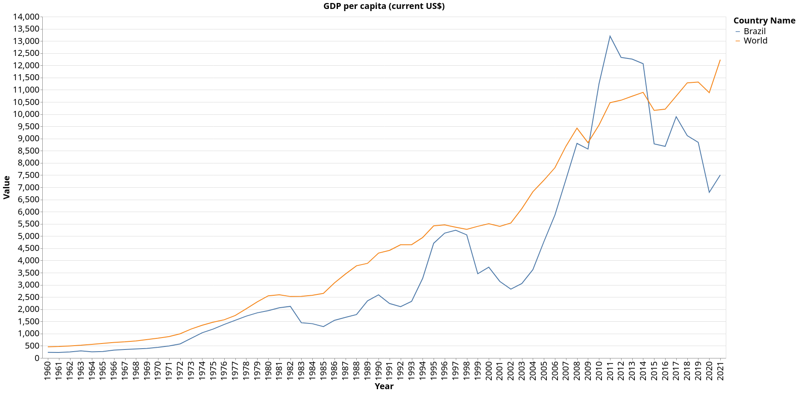

# The Scourge of the Privilege Economy: Brazil, 1947-2020

## Chapter 1 - Growth, fiscal crisis and stagnation: culture and institutions

At the beginning of the chapter the author defines economic stagnation, dividing it in two types: absolute and relative stagnation. Absolute stagnation happens when the per capital income decreases, while relative stagnation happens when the per capita income grows less than global or regional per capita income.

The World Bank has cross-country data on per capita income that can range from 1960 to 2021, depending of the data type. The per capita income can be measured in different ways, using current US dollars or purchasing power parity (PPP). 

In the case of Brazil, when compared to the rest of the world, the path of the per capita income in US dollars can be seen in the graph bellow.

From this data we can highlight the periods of absolute growth and stagnation.

